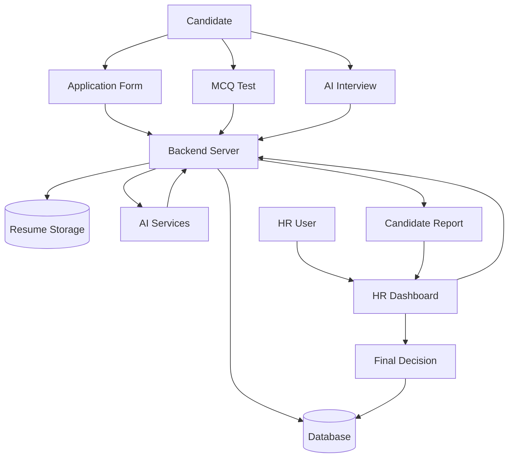
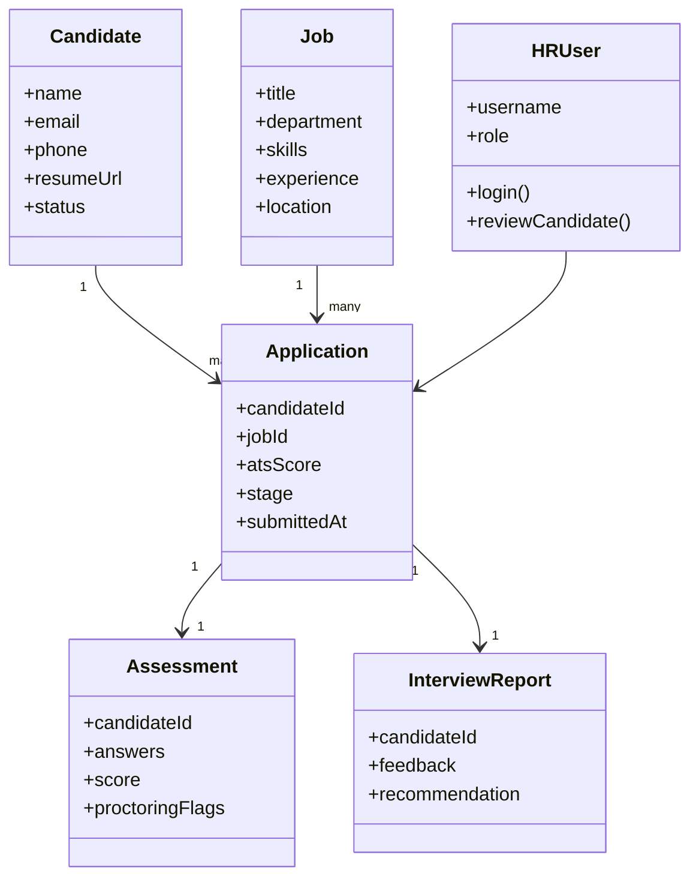
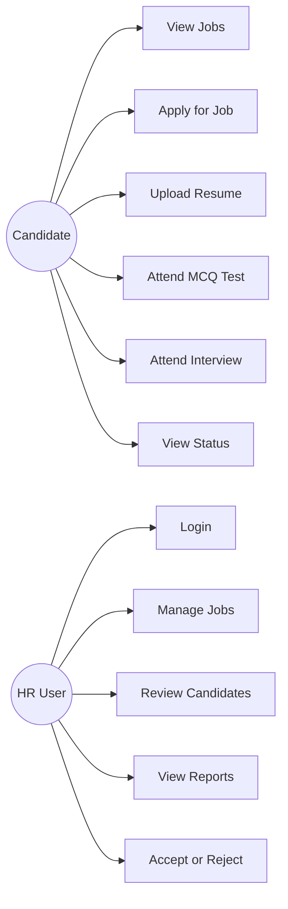
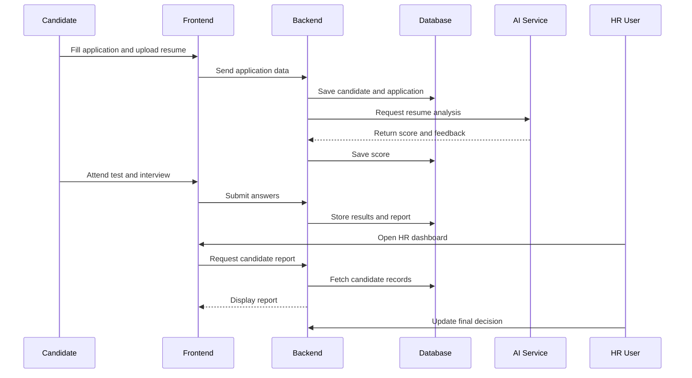
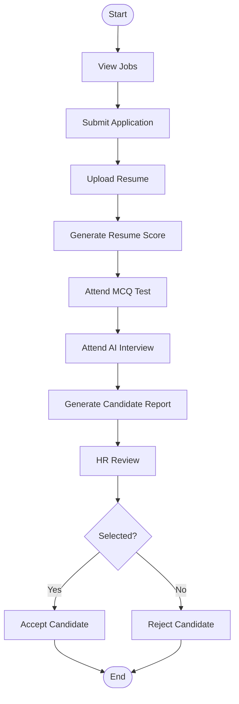
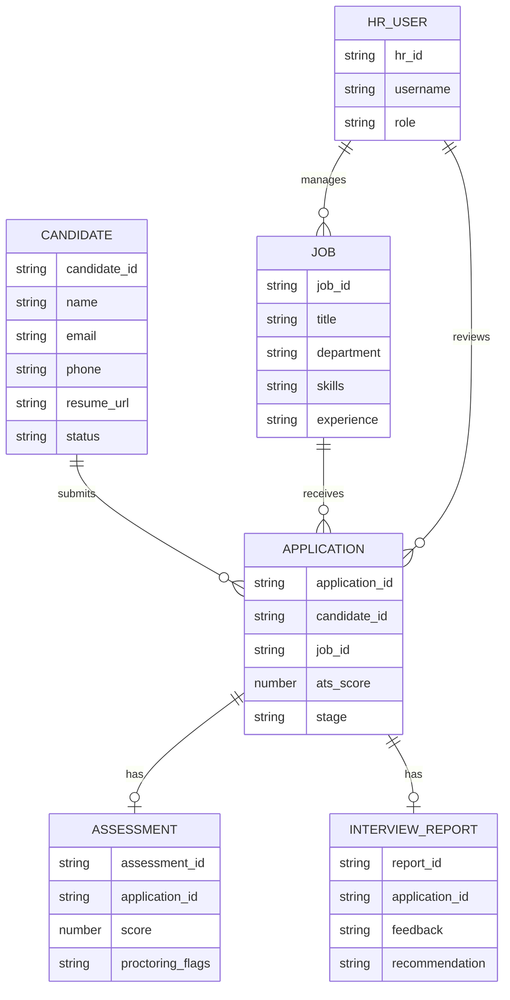
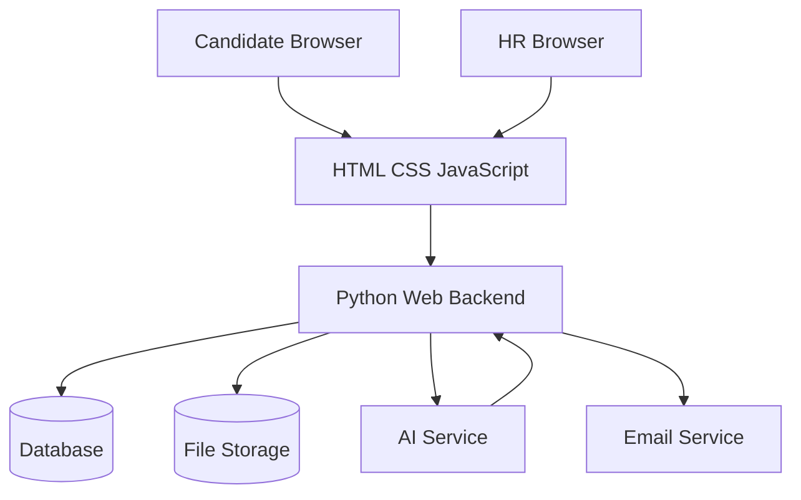

# ZYRA: AI-Powered Recruitment, Screening, and Interview Management System

## Abstract

Zyra is an AI-powered recruitment, screening, and interview management system designed to improve the speed, accuracy, and organization of modern hiring workflows. Traditional recruitment processes often depend on manual resume checking, disconnected assessment tools, subjective interview feedback, and time-consuming HR coordination. These limitations can delay hiring decisions and make it difficult to evaluate candidates consistently.

The proposed system provides a centralized web-based platform where candidates can view available jobs, submit applications, upload resumes, attend MCQ screening tests, and participate in AI-assisted virtual interviews. HR users can manage job openings, monitor candidate progress, review assessment results, generate reports, and make final selection decisions from a single dashboard. The system uses Python Flask for backend development, MongoDB for data storage, HTML, CSS, and JavaScript for the frontend, and AI services for resume scoring, question generation, and interview evaluation.

Zyra reduces repetitive HR effort by automating initial screening tasks and organizing candidate information throughout the recruitment lifecycle. Features such as ATS-style resume analysis, role-based MCQ tests, proctoring support, AI interview feedback, and structured candidate reports help improve transparency and decision-making. The system keeps human HR review at the center of final selection while using AI as a support tool for faster and more consistent recruitment.

Overall, Zyra demonstrates how web technologies and artificial intelligence can be combined to create an efficient, scalable, and user-friendly recruitment management solution for educational, small-scale, and future enterprise hiring environments.

**Keywords:** Artificial Intelligence, Recruitment Management System, Resume Screening, Applicant Tracking System, MCQ Assessment, Virtual Interview, HR Dashboard, Flask, MongoDB.

## Table of Contents

Chapter 1: INTRODUCTION
1.1 Introduction ................................................................................................. 1
1.2 Research Motivation .................................................................................... 2
1.3 Problem Definition ...................................................................................... 3
1.4 Significance ................................................................................................. 4
1.5 Applications ................................................................................................. 5
1.6 Objectives of the Project ............................................................................. 6

Chapter 2: LITERATURE SURVEY ................................................................. 7
2.1 Overview of Existing Recruitment Systems ................................................ 7

Chapter 3: SYSTEM ANALYSIS (EXISTING SYSTEM) ................................ 9
3.1 Manual Resume Screening System ............................................................. 9
3.2 Separate Recruitment and Assessment Tools .............................................. 10
3.3 Email and Telephonic Coordination ............................................................ 11
3.4 Spreadsheet-Based Candidate Tracking ...................................................... 12
3.5 Overall Drawbacks of Existing Recruitment Systems ................................. 13

Chapter 4: PROPOSED SYSTEM ..................................................................... 15
4.1 System Overview ......................................................................................... 15
4.2 Key Features and Functionalities ................................................................. 15
4.3 Advantages of Proposed System .................................................................. 16

Chapter 5: SYSTEM REQUIREMENTS ........................................................... 17
5.1 Hardware Requirements ............................................................................... 17
5.2 Software Requirements ................................................................................ 17
5.3 Functional Requirements ............................................................................. 18
5.4 Non-Functional Requirements ..................................................................... 18

Chapter 6: TECHNOLOGY DESCRIPTION .................................................... 19
6.1 Python and Flask Framework ...................................................................... 19
6.1.1 Features of Flask ...................................................................................... 20
6.2 MongoDB Database ..................................................................................... 21
6.3 AI Services and Resume Processing ........................................................... 22
6.4 Frontend Technologies and Digital Records ............................................... 23
6.5 Steps in System Workflow .......................................................................... 24

Chapter 7: SYSTEM DESIGN AND DIAGRAMS ........................................... 25
7.1 Input Design ................................................................................................. 25
7.2 Output Design .............................................................................................. 25
7.3 Data Flow Diagram ..................................................................................... 26
7.4 UML Class Diagram .................................................................................... 27
7.5 Use Case Diagram ........................................................................................ 28
7.6 Sequence Diagram ....................................................................................... 29
7.7 Activity Diagram .......................................................................................... 30
7.8 ER Diagram .................................................................................................. 31
7.9 System Architecture ..................................................................................... 32
7.10 Resume Matching and Candidate Classification Logic ............................. 33

Chapter 8: SAMPLE CODE .............................................................................. 34

Chapter 9: TESTING ......................................................................................... 40
9.1 Basics of Software Testing .......................................................................... 40
9.2 Types of Testing .......................................................................................... 40

Chapter 10: RESULTS AND DISCUSSION ..................................................... 42
Chapter 11: PERFORMANCE ANALYSIS ...................................................... 49
Chapter 12: CONCLUSION AND FUTURE SCOPE ....................................... 51
Chapter 13: REFERENCES ............................................................................... 52

---

## List of Figures

| S.NO | Fig No | FIGURE NAME | PAGE NO. |
|---:|:---:|---|:---:|
| 1 | 1.6.1 | Block Diagram of Zyra Recruitment System | 6 |
| 2 | 6.2.1 | Flask and MongoDB System Architecture | 20 |
| 3 | 7.3.1 | Data Flow Diagram | 26 |
| 4 | 7.4.1 | UML Class Diagram | 27 |
| 5 | 7.5.1 | Use Case Diagram | 28 |
| 6 | 7.6.1 | Sequence Diagram | 29 |
| 7 | 7.7.1 | Activity Diagram | 30 |
| 8 | 7.8.1 | ER Diagram | 31 |
| 9 | 7.9.1 | System Architecture Diagram | 32 |
| 10 | 11.1 | Candidate Evaluation Performance Chart | 50 |

---

## List of Screenshots

| S.No | List of Figures | Page No |
|---:|---|:---:|
| 1 | 9.1.1 Landing Page | 41 |
| 2 | 9.2.1 Job Application Page | 41 |
| 3 | 9.3.1 Candidate Dashboard | 42 |
| 4 | 9.4.1 MCQ Test Page | 42 |
| 5 | 9.4.2 Coding Assessment Page | 42 |
| 6 | 9.5.1 AI Avatar Interview Page | 43 |
| 7 | 9.6.1 HR Dashboard Report Page | 43 |
| 8 | 9.7.1 Application Status and Final Recommendation | 44 |

---

## List of Tables

| S.NO | TABLE NO | TITLE | PAGE NO. |
|---:|:---:|---|:---:|
| 1 | 11.1 | Candidate Evaluation Performance Summary | 49 |

---

## List of Acronyms

| ACRONYM | FULL FORM |
|---|---|
| AI | Artificial Intelligence |
| API | Application Programming Interface |
| ATS | Applicant Tracking System |
| DFD | Data Flow Diagram |
| ER | Entity Relationship |
| HR | Human Resources |
| HTML | HyperText Markup Language |
| HTTP | HyperText Transfer Protocol |
| JSON | JavaScript Object Notation |
| LLM | Large Language Model |
| MCQ | Multiple Choice Question |
| PDF | Portable Document Format |
| UML | Unified Modeling Language |

---

# Chapter 1: INTRODUCTION

## 1.1 Introduction

Zyra is an AI-powered recruitment, screening, and interview management system designed to make the hiring process faster, more organized, and more consistent. The system provides a digital platform where candidates can view job openings, submit applications, upload resumes, attend online assessments, participate in an AI-assisted interview flow, and receive updates about their progress. HR users can manage job listings, review candidate details, monitor assessment results, generate reports, and make final selection decisions through a centralized dashboard.

Traditional recruitment workflows often depend on manual resume checking, scattered records, repeated communication, separate testing tools, and subjective interview notes. These practices make it difficult for HR teams to handle large numbers of applicants efficiently. Zyra solves this problem by combining resume screening, candidate tracking, MCQ assessment, interview evaluation, and reporting into one web-based system.

The project focuses on improving recruitment efficiency while keeping human decision-making at the center. AI is used as a support mechanism for resume matching, question generation, feedback preparation, and report organization. Final hiring decisions remain under HR control.

## 1.2 Research Motivation

## 1.3 Problem Definition

Zyra aims to solve this problem by offering a single digital system for application collection, resume processing, assessment management, AI-assisted interview evaluation, candidate reporting, and HR decision support.

## 1.4 Significance

## 1.5 Applications

## 1.6 Objectives of the Project

---

# Chapter 2: LITERATURE SURVEY

## 2.1 Overview of Existing Recruitment Systems

Several existing studies and systems show that recruitment technology has shifted from manual hiring workflows to digital applicant tracking systems. Job portals allow organizations to publish openings and collect applications, while applicant tracking systems help store resumes and candidate information. Online assessment platforms support technical and aptitude testing, and video interview tools support remote interview processes.

However, many existing systems focus on only one part of recruitment. Some platforms are strong in job posting but weak in assessment. Some provide testing but do not include resume analysis. Others support interviews but do not generate complete candidate reports. Because of this, HR teams often use multiple tools together, which creates data duplication and coordination difficulty.

Research on AI in recruitment shows that automated resume screening, natural language processing, and structured scoring can help reduce HR workload. At the same time, studies also emphasize the need for human supervision to avoid unfair or fully automated hiring decisions. Zyra follows this balanced approach by using AI for support tasks while keeping final selection under HR review.

The literature survey helped identify the need for an integrated system that combines candidate application, resume screening, assessment, interview evaluation, and report generation in a single workflow.

---

# Chapter 3: SYSTEM ANALYSIS (EXISTING SYSTEM)

## 3.1 Manual Resume Screening System

In the existing recruitment process, resumes are often checked manually by HR staff. Candidates submit resumes through email, forms, or job portals, and HR users review each resume one by one to identify skills, experience, education, and role suitability. This process is time-consuming when many candidates apply for the same position.

Manual resume screening may also lead to missed skills, inconsistent judgment, delayed shortlisting, and repeated effort. Since there is no automatic matching score, comparing candidates fairly becomes difficult.

## 3.2 Separate Recruitment and Assessment Tools

Many organizations use separate tools for job posting, resume collection, online tests, video interviews, and reporting. Although each tool performs its own function, the complete recruitment workflow remains disconnected.

HR users may need to download reports from one system, check resumes in another, conduct interviews using a different platform, and then update candidate status manually. This increases workload and may create incomplete or mismatched candidate records.

## 3.3 Email and Telephonic Coordination

Recruitment coordination is often handled through emails and phone calls. HR staff contact candidates to share test links, interview timings, login details, document requirements, and result updates.

When the number of candidates increases, this coordination becomes difficult to manage. Candidates may miss updates, and HR teams may spend extra time repeating the same information to different applicants.

## 3.4 Spreadsheet-Based Candidate Tracking

Spreadsheets are commonly used to track candidate names, contact details, resume status, test scores, interview remarks, and final decisions. They are simple to use but are not suitable for complete recruitment management.

Spreadsheet-based tracking can lead to duplicate records, accidental edits, version conflicts, and difficulty in maintaining real-time updates. It also does not support resume upload, AI scoring, online assessment, interview feedback, or dashboard-based reporting.

## 3.5 Overall Drawbacks of Existing Recruitment Systems

The major drawbacks of existing recruitment systems are:

- High manual workload for HR users.
- Delay in resume screening and candidate shortlisting.
- Scattered candidate records across emails, files, and spreadsheets.
- Difficulty in tracking candidate progress.
- Lack of automated role-based resume matching.
- Limited support for online assessment and proctoring.
- Inconsistent interview feedback and reporting.
- Poor integration between candidate application and HR decision-making.

These drawbacks show the need for a centralized, automated, and AI-supported recruitment management system such as Zyra.

---

# Chapter 4: PROPOSED SYSTEM

## 4.1 System Overview

The proposed system, Zyra, is a web-based AI-powered recruitment platform that connects candidate application, resume screening, online assessment, AI avatar interview, HR dashboard, and report generation in one workflow. It provides separate interfaces for candidates and HR users.

Candidates can view job openings, submit application details, upload resumes, attend MCQ and coding assessments, and complete the AI avatar interview. HR users can log in to the dashboard, monitor candidate progress, review scores and reports, and update final candidate status.

## 4.2 Key Features and Functionalities

The important features of Zyra are:

- Candidate registration and job application.
- Resume upload and digital record storage.
- Job management for HR users.
- ATS-style resume matching and scoring.
- Role-based MCQ assessment.
- Coding assessment support.
- Proctoring support such as tab-switch tracking.
- AI-assisted avatar interview and feedback flow.
- Candidate report generation.
- HR dashboard for candidate monitoring.
- Final candidate status update such as accepted, rejected, shortlisted, or promoted.

These features combine to form an end-to-end recruitment workflow that reduces manual effort and improves decision-making.

## 4.3 Advantages of Proposed System

The advantages of the proposed Zyra system are:

- Reduces manual resume screening effort for HR users.
- Maintains candidate records in one centralized platform.
- Improves speed of shortlisting and decision-making.
- Provides ATS-style scoring based on job requirements.
- Supports online MCQ, coding, and interview stages.
- Improves assessment integrity through proctoring support.
- Generates structured candidate reports for HR review.
- Reduces dependency on paper records, emails, and spreadsheets.
- Improves candidate experience through a clear digital process.

---

# Chapter 5: SYSTEM REQUIREMENTS

## 5.1 Hardware Requirements

- Processor: Intel Core i3 or above
- RAM: 4 GB or above
- Hard Disk: 20 GB or more
- System Type: 64-bit system
- Monitor: 1080p display
- Input Devices: Keyboard and mouse
- Camera: Webcam for proctored tests and AI avatar interview
- Microphone: Microphone or headset for interview interaction
- Network: Internet / Wi-Fi connection

The above hardware configuration is sufficient for smooth execution of the Zyra web application, candidate application process, resume upload, MCQ assessment, AI avatar interview, HR dashboard usage, and database management.

## 5.2 Software Requirements

- Operating System: Windows 10 / Windows 11 / Linux
- Programming Language: Python
- Framework: Flask
- Frontend Technologies: HTML, CSS, JavaScript
- Database: MongoDB
- IDE: VS Code / PyCharm
- Browser: Google Chrome / Mozilla Firefox / Microsoft Edge
- Version Control: Git
- File Storage: Cloudinary / GridFS
- AI Service: Groq API / Local AI fallback where configured
- Email Service: SMTP for sending candidate credentials and notifications

The above software requirements support the complete Zyra recruitment workflow. Python and Flask handle backend routes and APIs, MongoDB stores candidate and job data, frontend technologies provide the user interface, and AI services support resume screening, MCQ generation, avatar interview evaluation, and candidate report preparation.

## 5.3 Functional Requirements

- Candidate Registration and Login: The system allows candidates to register or log in using generated credentials and access their dashboard.
- Job Viewing: Candidates can view available job openings with details such as job title, department, skills, location, salary, and job type.
- Job Application Submission: Candidates can fill out the application form with personal details, experience information, selected skills, and preferred job role.
- Resume Upload: Candidates can upload their resume in digital format, and the uploaded file is stored and linked with the candidate profile.
- Resume Screening: The system analyzes the uploaded resume and generates an ATS-style matching score based on job requirements and candidate skills.
- MCQ Assessment: Candidates can attend role-based MCQ tests, and the system records answers, calculates scores, and stores results.
- Coding Assessment: The system supports coding or technical problem-solving rounds for roles that require practical technical evaluation.
- AI Avatar Interview: Candidates can attend an AI-assisted interview, and the system stores interview responses, feedback, and performance details.
- Proctoring Support: The system monitors assessment activity such as tab switching and permission checks to support test integrity.
- HR Login: HR users can securely log in before accessing dashboard features and recruitment records.
- HR Dashboard: HR users can view pending, shortlisted, rejected, and completed candidate records from one centralized dashboard.
- Candidate Report Generation: The system generates structured candidate reports containing resume score, assessment score, interview feedback, recommendation, and current status.
- Candidate Status Update: HR users can accept, reject, shortlist, or promote candidates based on evaluation results.

## 5.4 Non-Functional Requirements

---

# Chapter 6: 

## 

## 

## 

## 

## 

## 

---

# Chapter 7: 

## 

## 

## 7.3 Data Flow Diagram

The data flow diagram shows how information moves between candidates, HR users, frontend pages, backend services, database storage, and AI services.

## 

## 

## 

## 

The activity diagram shows the main process flow of the recruitment system.

## 

The ER diagram represents database relationships.

## 7.8 System Architecture

## 7.9 Resume Matching and Candidate Classification Logic

The matching logic compares candidate resume content with job requirements. Required skills are extracted from the selected job role, and the system checks how many of those skills appear in the resume. Based on matched skills, missing skills, assessment score, and interview feedback, the candidate can be classified for HR review.

---

# Chapter 8: SAMPLE CODE

The following sample code snippets represent important logic used in the system.

### 
---

# Chapter 9: TESTING

## 9.1 Basics of Software Testing

Software testing is the process of verifying that the system works according to requirements. Testing helps identify errors in forms, routes, database operations, scoring logic, authentication, and user workflows before the system is used in a real environment.

In Zyra, testing is important because the system handles candidate data, resume uploads, assessments, interview reports, and HR decisions. Each module must be checked to ensure that data is saved correctly, scores are calculated properly, pages load successfully, and users can complete their tasks without failure.

## 9.2 Types of Testing

The following types of testing are used:

- Unit Testing: Tests individual functions such as score calculation and file upload.
- Integration Testing: Tests interaction between frontend, backend, database, and AI services.
- System Testing: Tests the complete candidate and HR workflow.
- Usability Testing: Checks whether the interface is easy to use.
- Functional Testing: Verifies that each feature works according to requirements.
- Regression Testing: Ensures new changes do not break existing features.
- Acceptance Testing: Confirms that the system satisfies project objectives.

Sample test cases:

|

# Chapter 10: RESULTS AND DISCUSSION

## 10.1 Result Screenshots

### 9.1.1 Landing Page

The landing page provides the entry point for Zyra and guides users toward candidate and HR workflows.

### 9.2.1 Job Application Page

The job application page allows candidates to select a job role, enter personal details, choose skills, upload a resume, and submit the application.

### 9.3.1 Candidate Dashboard

The candidate dashboard displays the available recruitment stages and allows candidates to continue assessments and interview activities.

### 9.4.1 MCQ Test Page

The MCQ test page presents role-based questions and records candidate responses for evaluation.

### 9.4.2 Coding Assessment Page

The coding assessment section evaluates practical technical problem-solving ability where required for the selected role.

### 9.5.1 AI Avatar Interview Page

The AI avatar interview page conducts the virtual interview process and records candidate responses for feedback generation.

### 9.6.1 HR Dashboard Report Page

The HR dashboard report page allows HR users to review candidate scores, assessment details, interview feedback, and recommendations.

### 9.7.1 Application Status and Final Recommendation

This result view represents the candidate's application status and the final recommendation shown through the dashboard or report flow.

---

# Chapter 11: PERFORMANCE ANALYSIS

---

# Chapter 12: 

---

# Chapter 13: REFERENCES

1. Python Software Foundation, Python Documentation.
2. Flask Documentation, Pallets Projects.
3. MongoDB Documentation.
4. MongoDB Documentation.
5. Cloudinary Documentation.
6. Mozilla Developer Network, HTML, CSS, and JavaScript References.
7. Research articles on applicant tracking systems and AI-assisted recruitment.
8. Online resources related to resume screening, ATS scoring, and recruitment workflow automation.
